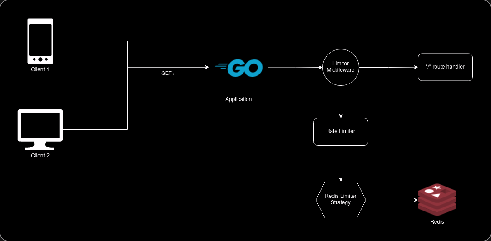
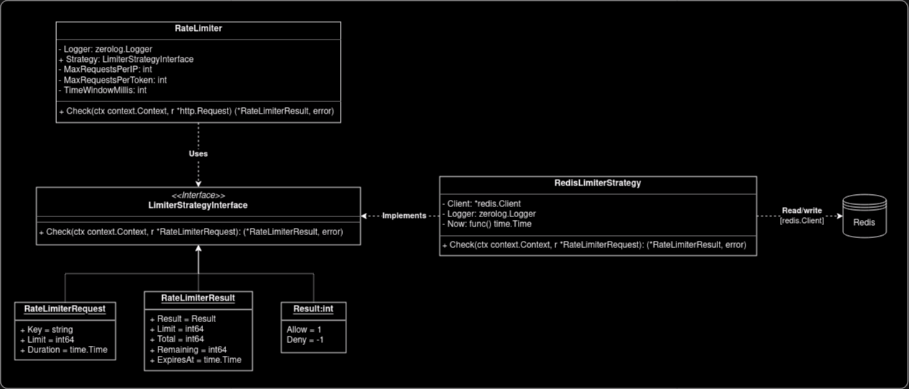

# Go Expert Challenge - Rate Limiter

Implementation of a rate limiter in Go for a web service capable of limiting the number of requests received from clients within a configurable time window, based on the IP address and/or access token `API_KEY`.

## Architecture



The application consists of a web server that receives HTTP requests and a rate limiter middleware responsible for controlling the number of requests received. The [middleware](internal/infra/web/middlewares/ratelimiter.go) intercepts all requests and executes the rate limiting logic using the [`RateLimiter`](internal/pkg/ratelimiter/limiter.go) instance, which contains the business rules and knows how to invoke the storage _Strategy_ instantiated by the [dependency manager](internal/pkg/dependencyinjector/injector.go) to perform limit checks.

The rate limiter is configurable to check limits by IP or `API_KEY` token, and uses Redis as _storage_ to store the number of requests made by each IP and/or token. This configuration is done through environment variables declared in the `.env` file and injected into the application via the [dependency manager](internal/pkg/dependencyinjector/injector.go) at application boot. The environment variables are:

- `RATE_LIMITER_IP_MAX_REQUESTS`: Maximum number of requests per IP
- `RATE_LIMITER_TOKEN_MAX_REQUESTS`: Maximum number of requests per token
- `RATE_LIMITER_TIME_WINDOW_MILISECONDS`: Time window in milliseconds

Example configuration to limit 10 requests per IP and 100 requests per token in a 5-minute window:

```sh
RATE_LIMITER_IP_MAX_REQUESTS=10
RATE_LIMITER_TOKEN_MAX_REQUESTS=100
RATE_LIMITER_TIME_WINDOW_MILISECONDS=300000
```

In this case, the rate limiter will block requests that exceed the configured limit, returning a `429 Too Many Requests` status and a JSON body `{"message":"rate limit exceeded"}`, as well as the headers `X-Ratelimit-Limit`, `X-Ratelimit-Remaining`, and `X-Ratelimit-Reset` with information about the limit, remaining requests, and reset time, respectively. New requests that exceed the configured limit will be blocked until the reset time (5 minutes, in this case) is reached.

### Storage Strategy

The storage strategy is defined through an interface `LimiterStrategyInterface` that has the `Check` method to get and set values in the _storage_. Currently, the application only has an implementation for Redis, but it is possible to add new implementations for other storages such as memory, database, etc., without changing the rate limiting logic, just by injecting the new implementation into the `RateLimiter` instance via the [dependency manager](internal/pkg/dependencyinjector/injector.go).



## Benchmarks

[Grafana k6](https://k6.io/) was used to perform [_smoke_](https://grafana.com/docs/k6/latest/testing-guides/test-types/smoke-testing/) and [_stress_](https://grafana.com/docs/k6/latest/testing-guides/test-types/stress-testing/) load tests on the service to evaluate the behavior of the developed solution. The results can be found [here](BENCHMARKS.md).

## Running the project

**Note:** You need to have [Docker](https://www.docker.com/) and [Docker Compose](https://docs.docker.com/compose/) installed.

1. Create a `.env` file in the project root by copying the contents of `.env.example` and adjust it as needed. By default, the following values are used:

```sh
LOG_LEVEL="debug" # Application log level
WEB_SERVER_PORT=8080 # Web server port

# Redis configuration
REDIS_HOST="localhost"
REDIS_PORT=6379
REDIS_PASSWORD=""
REDIS_DB=0

RATE_LIMITER_IP_MAX_REQUESTS=10 # Maximum requests per IP
RATE_LIMITER_TOKEN_MAX_REQUESTS=100 # Maximum requests per token
RATE_LIMITER_TIME_WINDOW_MILISECONDS=1000 # Time window in milliseconds
```

2. Run the command `docker compose up redis api` to start the application and Redis.

### Request examples

- **Successful request with IP check:**

```sh
$ curl -vvv http://localhost:8080

* processing: http://localhost:8080
*   Trying [::1]:8080...
* Connected to localhost (::1) port 8080
> GET / HTTP/1.1
> Host: localhost:8080
> User-Agent: curl/8.2.1
> Accept: */*
> 
< HTTP/1.1 200 OK
< Accept: application/json
< Content-Type: application/json
< X-Ratelimit-Limit: 10
< X-Ratelimit-Remaining: 9
< X-Ratelimit-Reset: 1707691706
< Date: Sun, 11 Feb 2024 22:48:25 GMT
< Content-Length: 27
< 
{"message":"Hello World!"}
```

- **Successful request with token check:**

```sh
$ curl -H 'API_KEY: some-api-key-123' -vvv http://localhost:8080

* processing: http://localhost:8080
*   Trying [::1]:8080...
* Connected to localhost (::1) port 8080
> GET / HTTP/1.1
> Host: localhost:8080
> User-Agent: curl/8.2.1
> Accept: */*
> API_KEY: some-api-key-123
> 
< HTTP/1.1 200 OK
< Accept: application/json
< Content-Type: application/json
< X-Ratelimit-Limit: 100
< X-Ratelimit-Remaining: 99
< X-Ratelimit-Reset: 1707692138
< Date: Sun, 11 Feb 2024 22:55:37 GMT
< Content-Length: 27
< 
{"message":"Hello World!"}
```

- **Blocked request with IP check:**

```sh
$ curl -vvv http://localhost:8080

* processing: http://localhost:8080
*   Trying [::1]:8080...
* Connected to localhost (::1) port 8080
> GET / HTTP/1.1
> Host: localhost:8080
> User-Agent: curl/8.2.1
> Accept: */*
> 
< HTTP/1.1 200 OK
< Accept: application/json
< Content-Type: application/json
< X-Ratelimit-Limit: 10
< X-Ratelimit-Remaining: 0
< X-Ratelimit-Reset: 1707691750
< Date: Sun Feb 11 2024 22:49:09 GMT
< Content-Length: 33
< 
{"message":"rate limit exceeded"}
```

- **Blocked request with token check:**

```sh
$ curl -H 'API_KEY: some-api-key-123' -vvv http://localhost:8080

* processing: http://localhost:8080
*   Trying [::1]:8080...
* Connected to localhost (::1) port 8080
> GET / HTTP/1.1
> Host: localhost:8080
> User-Agent: curl/8.2.1
> Accept: */*
> API_KEY: some-api-key-123
> 
< HTTP/1.1 200 OK
< Accept: application/json
< Content-Type: application/json
< X-Ratelimit-Limit: 100
< X-Ratelimit-Remaining: 99
< X-Ratelimit-Reset: 1707692150
< Date: Sun Feb 11 2024 22:55:49 GMT
< Content-Length: 33
< 
{"message":"rate limit exceeded"}
```

## Tests

### Unit tests

To run unit tests and validate coverage, run the command `make test`.

### Stress tests

To run stress tests with k6, follow these steps:

1. Start the application and Redis with the command `docker compose up redis api`;
2. Run the command `make test_k6_smoke` to start the smoke stress test (duration: 1 minute);
3. Run the command `make test_k6_stress` to start the stress test (duration: 40 minutes).

**Note:** You may need to close some programs on your computer so the stress test is not affected, as it consumes a lot of resources.

You can view the test results in the folders `./scripts/k6/smoke` and `./scripts/k6/stress`, both in text and HTML format.